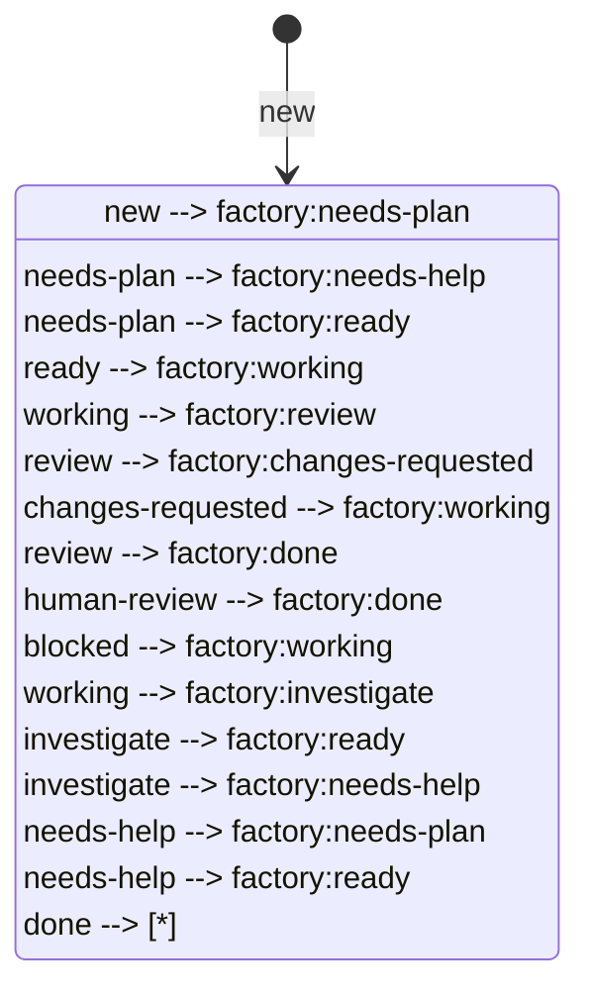

# Factory Lifecycle

This document defines the state transitions for issues in the Cezar factory.

## States

- `factory:new` - Initial state when an issue is created.
- `factory:needs-plan` - Ready for planning.
- `factory:needs-help` - Requires human input to proceed.
- `factory:tracking` - A non-lifecycle marker for an epic or tracking parent;
  it is not executable work and does not require human intervention.
- `factory:ready` - Planning complete, ready for implementation.
- `factory:working` - Implementation in progress.
- `factory:review` - Implementation submitted for review.
- `factory:changes-requested` - Reviewer requested changes.
- `factory:human-review` - Manual hold for an exceptional human decision.
- `factory:blocked` - Blocked by external dependencies.
- `factory:done` - Work is complete.
- `factory:investigate` - Repeated failure awaiting classification.

## Transitions

## Transition Rules

1. **Legal transitions** are only those shown in the diagram above.
2. **Automation ownership**:
   - `factory:needs-plan` → `factory:ready`: Planning automation
   - `factory:ready` → `factory:working`: Implementation automation
   - `factory:working` → `factory:review`: Implementation automation (after completion)
   - `factory:review` → `factory:changes-requested`: Review automation
   - `factory:review` → `factory:done`: Review automation after successful validation and approval; requests auto-merge into `dev`
   - `factory:changes-requested` → `factory:working`: Fix automation
   - `factory:human-review` → `factory:done`: Human decision for an exceptional hold
3. **Human-required transitions**:
   - Entry to `factory:needs-help`
   - Entry to `factory:human-review` only for an explicit human decision or exception
   - Exit from `factory:human-review` remains human-owned
4. **Blocked work resumption**: When a blocker is removed, the issue returns to `factory:working`.
5. **Conflicting state prevention**: An issue can only have one factory-state label at a time.

## Complexity routing

Planning assigns exactly one `complexity:*` label without changing lifecycle
state. Implementation automation routes small and medium work through the
configured Factory gateway, while large work uses the configured premium
large-work model. The bounded local model is reserved for explicitly cataloged
advisory jobs and never owns implementation. Apply a
complexity label before `factory:needs-plan` when the planning model itself
must be selected in advance; otherwise the normal planner assigns it for the
implementation automation.

## Enforcement

`.ai/factory/scripts/route-state.ps1` applies every transition driven by an agent result: it refuses a transition from the wrong source state, removes all other `factory:*` labels when setting one (so conflicting states cannot persist), and posts the plan, findings or escalation summary as an issue comment.

| Event | Required source | Result |
| --- | --- | --- |
| start | ready, changes-requested, blocked (no-op if working) | working |
| plan-result | needs-plan, new | ready; needs-help if not ready or `risk:high` (human plan approval); human-review if decomposed (sub-issues created as `factory:new`, humans pick which to plan) |
| implement-result | working | review; investigate if the agent reports failure |
| review-result | review | done with auto-merge requested on approval; changes-requested otherwise; needs-help once `max_review_fix_rounds` is reached |
| investigate-result | investigate, working | ready once if the retry is appropriate and confidence is not low; otherwise needs-help |

Humans own: leaving `needs-help`, exceptional `human-review` decisions,
approving `risk:high` plans (relabel `factory:ready`), and resuming `blocked`
work (relabel `factory:ready`; blocked is never set by automation). Approved,
validated PRs are otherwise auto-merged into `dev`.
